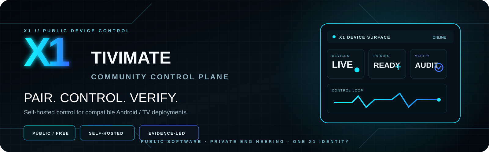
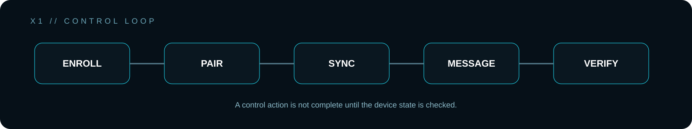
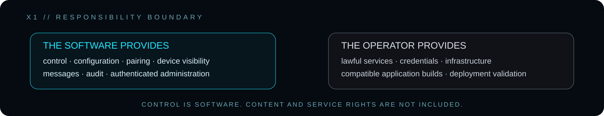

<p align="center">
  
</p>

<p align="center">
  <strong>PUBLIC · FREE · SELF-HOSTED</strong><br>
  Device control for compatible TiviMate-based deployments.
</p>

<p align="center">
  <a href="https://forum.x1panel.space">Forum</a> ·
  <a href="https://t.me/+XkuQS_QuD6g4Nzc0">Telegram</a> ·
  <a href="https://discord.gg/vSSw6jHmw">Discord</a>
</p>

---

## X1 TiviMate Community

**X1 TiviMate Community is a standalone public X1 project for managing compatible TiviMate-based deployments.**

It is not a deliberately limited demo. The public release is intended to be useful as released and can be self-hosted independently.

This project is also separate from X1's private commercial platforms. Public community software and private commercial systems are different products with different operating scopes.

---

<p align="center">
  
</p>

## What the public project manages

The current public control surface includes:

- portal configuration;
- device registry and online/offline visibility;
- welcome and runtime configuration;
- announcements and device messages;
- QR pairing;
- X1 Device Agent enrollment;
- authenticated device heartbeat;
- capability reporting;
- conservative remote actions such as configuration sync, message delivery and update checks;
- audit logging;
- secure administrator authentication;
- optional TOTP two-factor authentication.

The operating principle is simple:

> **A command being sent is not the same as a command being proven successful.**

For production use, validate the result on the actual compatible application/device build.

---

## Device control model

The public project follows a narrow operational loop:

```text
ENROLL
  ↓
PAIR
  ↓
SYNC / MESSAGE / UPDATE CHECK
  ↓
DEVICE REPORTS STATE
  ↓
VERIFY
```

The device agent is intended to support authenticated device communication and a deliberately conservative public command surface.

Implementation details that exist only for binary compatibility with older compatible builds are not part of the public product identity.

---

## Compatibility

This repository targets **compatible TiviMate-based Android deployments** tested against the integration surface provided by the project.

Application behavior can vary between builds. A feature existing in the panel does not prove that every historical or third-party APK implements that feature at runtime.

For real deployment confidence:

1. configure the panel;
2. pair a real device;
3. exercise the required action;
4. verify the resulting state on the device.

---

<p align="center">
  
</p>

## Responsibility boundary

X1 TiviMate Community is **control software**.

It does not provide IPTV channels, subscriptions, playlists, portal credentials or copyrighted media. Operators are responsible for the infrastructure, services, credentials, application builds and content they configure, and for ensuring they are authorized to use them.

---

## Requirements

Recommended environment:

```text
PHP 8.2+
MariaDB 10.6+ or MySQL 8+
nginx
PDO MySQL
OpenSSL
zlib
mbstring
JSON
HTTPS
```

---

## Installation

Create the environment file:

```bash
cp .env.example .env
```

Configure the installation-specific application URL and database credentials, generate a unique application key, then run:

```bash
php bin/migrate.php
```

Create the first administrator with the included CLI utility and point the web server to the public web root.

An example nginx configuration is included in the repository.

### Never expose private runtime paths

Do not serve configuration, storage, internal modules, database tooling or CLI directories directly through the web server.

Generate deployment secrets on the target installation. Never reuse example credentials.

---

## Public distribution

Public packages must not include installation-specific or private material such as:

- environment files with real secrets;
- production database credentials;
- private/signing keys;
- Android keystores or keystore passwords;
- bot/service credentials;
- customer data;
- runtime databases;
- uploaded private application artifacts.

Code protection or obfuscation may make casual copying more difficult, but **obfuscation is not a security boundary**.

---

## Security

For production installations:

- use HTTPS;
- use unique administrator credentials;
- enable TOTP where appropriate;
- keep PHP/database packages current;
- protect configuration and runtime storage from direct web access;
- review audit data;
- rotate exposed secrets immediately.

Security reports are welcome. Do not publish live credentials, private keys, customer information or working exploitation details in public issues.

---

## Independent project notice

X1 TiviMate Community is an independent X1 community project. It is not presented as an official product of, or as affiliated with, the developers or owners of the TiviMate trademark.

---

## Community distribution

The public project is free to download and use under the distribution terms included with the repository.

Redistribution must preserve the applicable X1 branding and license terms and must not present the software as another vendor's product or include private/commercial X1 components.

See `COMMUNITY_LICENSE.txt` for the repository's distribution terms.

---

## X1 ecosystem

This repository is one public X1 project. It should not be interpreted as the complete X1 platform or as a public blueprint of X1's private commercial engineering.

<p align="center">
  <strong>PAIR THE DEVICE.</strong><br>
  <strong>CONTROL THE STATE.</strong><br>
  <strong>VERIFY THE RESULT.</strong><br><br>
  <strong>X1 // DEVICE CONTROL</strong>
</p>

<p align="center">
  © 2026 X1Tech Solutions SA. All Rights Reserved.
</p>
